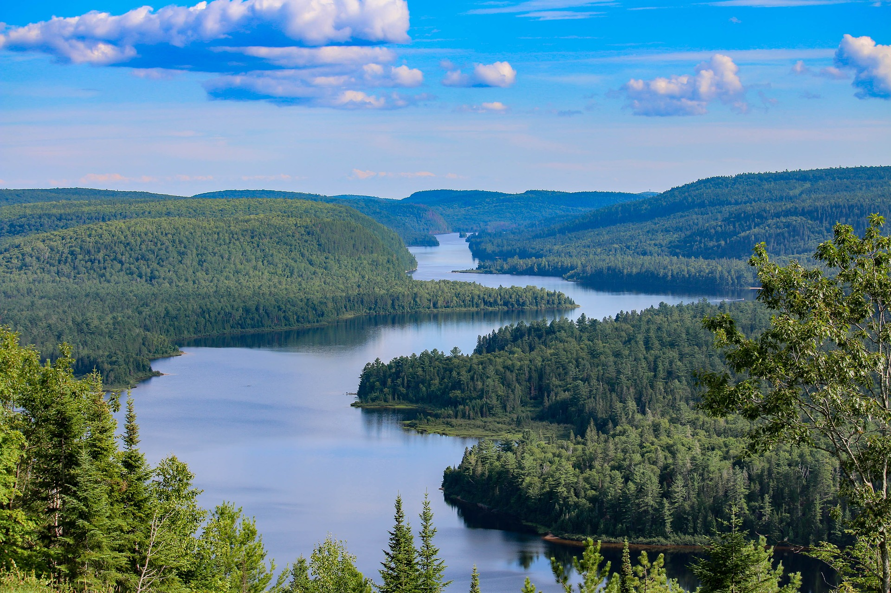

---
title:
author: "Alessandro filazzola"
date: "2019"
output:
  html_document:
    theme: flatly
    toc: yes
    toc_depth: 3
    toc_float: yes
  pdf_document:
    toc: yes
editor_options: 
  chunk_output_type: console
---
<br>  

### A global database for chlorophyll and water chemistry in freshwater lakes 

[Alessandro Filazzola](http://www.filazzola.info/), Octavia Mahdiyan, Kevin Blagrave, Carolyn Ewins,  Arnab Shuvo, Tanzil Sadid, Luke Moslenko, Mohammad Arshad, [Derek Gray](http://graylaboratory.ca/), [Roberto Quinlan](http://www.yorku.ca/rquinlan/), [Catherine O’Reilly](https://my.ilstu.edu/~cmoreil/index.html)  & [Sapna Sharma](https://sharmalab.wordpress.com/)

Part of the York University [Aquatic Research Group](http://www.yorkaquaticresearch.ca/)


<br> 

### Abstract

Measures of chlorophyll represent the primary productivity in freshwater lakes that is often used by managers as proxy for water quality. However, the abundance of chlorophyll in lakes is dependent on many interacting factors such as spatial heterogeneity (within and among lakes), climate, and anthropogenic disturbance. Aquatic research examining water chemistry frequently include measures of chlorophyll values and this data is readily available in published manuscripts or online repositories. Thus, there is an opportunity to synthesize a global database on the water chemistry of lakes with focus on chlorophyll. The purpose of this project is to generate a database of freshwater lakes across the globe and through time. We intend to conduct a systematic review examining over 3000 published manuscripts that examined lake chlorophyll and supplement this data with online repositories such as KnB, Dryad, and Pangaea. Using the geospatial coordinates of the lakes we can relate measures of chlorophyll to climate patterns, anthropogenic disturbances, and other changes over time. This database will be used by researchers to improve our understanding of how chlorophyll responds to global change and assist aquatic managers responsible for maintaining water quality in lakes. 

### Literature Review

A systematic literature search was conducted using Web of Science for all articles between 2000 and 2018. This time frame was chosen because it captures the majority of the literature that measured chlorophyll values. Papers were excluded that were not primary articles and were not relevant (e.g. virology, sociology, physics, etc)

Data was be extracted from papers or supplemental materials. Authors will be contacted for their available data if not available online. Additional datasets will be obtained used online repostiories (e.g. Dryad, KnB, Github) and more general searches online. 

`chlorophyll`
**AND** 
`lake*`


### Load Libraries
```{r warning=FALSE, message=FALSE}
#libraries
library(tidyverse)
library(ggmap)
library(dataone)

## get standard error function
se <- function(x) sqrt(var(x)/length(x))

options(scipen=6) ## lower threshold for scientific notation
```

### Download data from KNB
```{r}
## Select KNB repo for download and database identifiers
cn <- CNode("PROD")
mn <- getMNode(cn, "urn:node:KNB")
id <- "doi:10.5063/F1RV0M1S"
uuid <- "urn:uuid:317170a4-fbe5-4b20-8d32-bdf896b2b75e"


## Get Meta data
library(XML)
metadata <- rawToChar(getObject(mn, id))
doc = xmlRoot(xmlTreeParse(metadata, asText=TRUE, trim = TRUE, ignoreBlanks = TRUE))
tf <- tempfile()
saveXML(doc, tf)
file.show(tf)

## Get Raw data
databasePath <- getPackage(mn, id=uuid, dirPath=".", unzip=T)

## List files
list.files(paste0(databasePath,"/data/"))

```

### Map of studies
```{r}

data <- read.csv("data//ChlaData.csv")

## plot out global distribution of lake chl
mp <- NULL
mapWorld <- borders("world", colour="gray50", fill="gray50") # create a layer of borders
mp <- ggplot() +   mapWorld

mp <- mp+ geom_point(data=data , aes(x=Lon, y=Lat), size=1, alpha=0.3, color="#176117") + xlab("Longitude") + ylab("Latitude")
mp

```


### Patterns in chlorophyll distribution
```{r warning=FALSE, message=FALSE}

## get standard error function
se <- function(x) sqrt(var(x)/length(x))


## Plot distribution of Chl values
ggplot(data, aes(x=log(ChlValues))) + geom_density(fill="#9ACC7C") + xlab("Log transformed Chlorophyll a (mg/L)") + ylab("Frequency of observered values") + 
  annotate("text", x=-1, y=0.3, label=paste("minimum = 0 mg/L"), size=5) + ## min
  annotate("text", x=-1, y=0.27, label=paste("maximum = ",max(data$ChlValues), "mg/L"), size=5)  + ## max
  annotate("text", x=-1, y=0.24, label=paste("median ± SE = ",round(median(data$ChlValues),3), "±", formatC(round(se(data$ChlValues),4), digits=4,format="f") , "mg/L"), size=5) +theme(axis.text=element_text(size=12),
        axis.title=element_text(size=14,face="bold"))+ theme(panel.grid.major = element_blank(), panel.grid.minor = element_blank()) + xlim(-10,3) 
# + geom_vline(xintercept = log(2.5/1000), lty=2) + geom_vline(xintercept = log(0.001), lty=2)
```


### Check methods types
```{r warning=FALSE, message=FALSE}
method <- read.csv("data//methodsDataV2.csv", stringsAsFactors = F)


## merge methods file, chlorophyll, and survey information into one file
methodID <- merge(data, method, by="StudyID", all.x=T)


## method for calculating Chl
chlsurvey <- methodID %>% group_by(Survey.Type) %>% summarize(chl=mean(ChlValues), error=se(ChlValues)*1.96, n=length(ChlValues)) %>% filter(!Survey.Type %in% c("not described","undescribed","")) %>% filter(!is.na(Survey.Type))


plot1 <- ggplot(chlsurvey, aes(x=Survey.Type, y=chl))+ geom_bar(stat="identity", fill="#9ACC7C", color="black") + geom_errorbar(aes(x=Survey.Type,  ymin=chl-error, ymax=chl+error), lwd=1, width=0.2)  + xlab("") + ylab("Chlorophyll a (mg / L)")+theme(axis.text=element_text(size=12),
        axis.title=element_text(size=14,face="bold"))+ theme(panel.grid.major = element_blank(), panel.grid.minor = element_blank())+
   scale_y_continuous(expand = c(0, 0), limits = c(0,0.08)) + annotate(geom ="text", x=0.5, y=0.075, label="a", size=10)

## water survey location
chllocation <- methodID %>% group_by(Depth.qual) %>% summarize(chl=mean(ChlValues), error=se(ChlValues)*1.96, n=length(ChlValues)) %>% filter(!Depth.qual %in% c("not described","undescribed")) %>% filter(!is.na(Depth.qual))

plot2 <- ggplot(chllocation, aes(x=Depth.qual, y=chl))+ geom_bar(stat="identity", fill="#9ACC7C", color="black") + geom_errorbar(aes(x=Depth.qual,  ymin=chl-error, ymax=chl+error), lwd=1, width=0.5) +  xlab("") + ylab("")+theme(axis.text=element_text(size=12),
        axis.title=element_text(size=14,face="bold"))+ theme(panel.grid.major = element_blank(), panel.grid.minor = element_blank())+
  scale_y_continuous(expand = c(0, 0), limits = c(0,0.04))+ annotate(geom ="text", x=0.5, y=0.075, label="b", size=10)

library(gridExtra)

grid.arrange(plot1, plot2, ncol=2)


## compare methods
method %>% group_by(Depth.qual) %>% summarize(n=length(Depth.quant))

```


### Compare lakes frequency based on trophic status
```{r warning=FALSE, message=FALSE}

chl <- data %>% mutate(Chl.ug = ChlValues*1000) %>%   mutate(trophic=cut(Chl.ug, breaks=c(-Inf, 7, 9, 26, 75, Inf), labels=c("Oligotrophic","Oligo-mesotrophic","Mesotrophic","Eutrophic","Hyper-eutrophic")))
## breaks taken from NWT Government Worksheet https://www.enr.gov.nt.ca/sites/enr/files/chlorophyll.pdf

chl.n <- chl %>% group_by(trophic) %>% summarize(n=length(Chl.ug))

## plot out lake frequency
ggplot(chl.n, aes(x=trophic, y=n)) + geom_bar(stat="identity")


```
                                         

### Summary statistics of dataset
```{r warning=FALSE, message=FALSE}
## Unique Lake IDs
data[,"UniqueLakeLocation"] <- paste0(data$Lat, data$Lon, sep=";")
data2 <-data 
data2 <- data2[!duplicated(data2$UniqueLakeLocation),]

## number of unique locations
nrow(data2)

## Number of Countries surveyed
library(maps)
data[,"CountryOfficial"] <- map.where(database="world", data$Lon, data$Lat)
## separate subcountry identifiers
country <- gsub("?:.*", "", data$CountryOfficial)
length(unique(country))

## water chem values
data %>% filter(!is.na(TN))  %>%  summarize(low=min(TN), high=max(TN), avg=mean(TN), n=length(TN), prop=n/nrow(data)) ## amount of TN values
data %>% filter(!is.na(TP))  %>%  summarize(low=min(TP), high=max(TP), avg=mean(TP), n=length(TP), prop=n/nrow(data))## amount of TP values
data %>% filter(!is.na(DO))  %>%  summarize(low=min(DO), high=max(DO), avg=mean(DO), n=length(DO), prop=n/nrow(data))## amount of DO values
data %>% filter(!is.na(DOC))  %>%  summarize(low=min(DOC), high=max(DOC), avg=mean(DOC), n=length(DOC), prop=n/nrow(data))## amount of DOC values
data %>% filter(!is.na(pH))  %>%  summarize(low=min(pH), high=max(pH), avg=mean(pH), n=length(pH), prop=n/nrow(data)) ## amount of pH
data %>% filter(!is.na(ChlValues))  %>%  summarize(low=min(ChlValues), high=max(ChlValues), avg=mean(ChlValues), n=length(ChlValues), prop=n/nrow(data))

## lake char values
data %>% filter(!is.na(Depth.max))  %>%  summarize(low=min(Depth.max), high=max(Depth.max), avg=mean(Depth.max), n=length(Depth.max), prop = n/nrow(data)) ## max lake depth
data %>% filter(!is.na(Depth.mean))  %>%  summarize(low=min(Depth.mean), high=max(Depth.mean), avg=mean(Depth.mean), n=length(Depth.mean), prop = n/nrow(data))## mean lake depth
data %>% filter(!is.na(Secchi))  %>%  summarize(low=min(Secchi), high=max(Secchi), avg=mean(Secchi), n=length(Secchi), prop = n/nrow(data)) ## Secchi depth
data %>% filter(!is.na(SurfaceArea))  %>%  summarize(low=min(SurfaceArea), high=max(SurfaceArea), avg=mean(SurfaceArea), n=length(SurfaceArea), prop=n/nrow(data))  ## surface area
data %>% filter(!is.na(LakeVolume))  %>%  summarize(low=min(LakeVolume), high=max(LakeVolume), avg=mean(LakeVolume), n=length(LakeVolume), prop=n/nrow(data))  ## surface area


```

### Create barplots of variables
```{r}
chlaLong <- data %>% gather(variable, value, 9:19)

chlaLong[chlaLong$variable=="pH","value"] <- 10^chlaLong[chlaLong$variable=="pH","value"]

ggplot(chlaLong, aes(y=log10(value))) + geom_boxplot() + facet_grid(.~variable, scales="free") +theme(axis.text=element_text(size=12),
        axis.title=element_text(size=14,face="bold"))+ theme(panel.grid.major = element_blank(), panel.grid.minor = element_blank())
```


### Repository statistics
```{r}
## Select only repo datasets
data$StudyID <- as.character(data$StudyID) 
repoData <- data[grep("repo*", data$StudyID),]

## Number of lakes
repoData %>% group_by(StudyID) %>% summarize(n=length(unique(UniqueLakeName)))
## Number of observations
repoData %>% group_by(StudyID) %>% summarize(n=length(uniqueID))
## Timeframe
repoData %>%  group_by(StudyID) %>% mutate(Year = as.numeric(as.character(Year))) %>%  summarize(first = min(Year), last = max(Year))
```

### Methods summary variables
```{r}
method <- read.csv("data//methodsDataV2.csv", stringsAsFactors = F)

method %>% group_by(Survey.Type) %>% summarize(n=length(Survey.Type))
method %>% group_by(DepthDetails) %>% summarize(n=length(DepthDetails))
max(method$DepthDeep, na.rm=T) ## Lake Baikal
method %>% group_by(DetectionLimits) %>% summarize(n=length(DetectionLimits))


```

### Identify country or region using lat-lon
```{r}
library(maps)
library(raster)
data$UniqueLakeName <- as.character(data$UniqueLakeName)
data[,"countries"] <- map.where(x = data$Lon, y = data$Lat)
indiaLake <- data[data$countries=="India",]
indiaLake <- indiaLake %>% dplyr::filter(countries != "NA")

## Get lakes for Ontario or any other region
CanadaLake <- data[data$countries=="Canada",]
CanadaLake <- CanadaLake %>% dplyr::filter(countries != "NA")
OntLake <- CanadaLake %>% filter()

## Get polygon for Region
can <- raster::getData("GADM", country="CAN", level=1) ## use state bounds from gadm website:
ont <- can[can$NAME_1 == "Ontario",]

## Create spatial points for observations
coordinates(OntLake) <- ~Lon+Lat
crs(OntLake) <- crs(ont)

## Mask region to identify specific observations
regionOut <- OntLake[!is.na(over(OntLake,as(ont,"SpatialPolygons"))),]
write.csv(as.data.frame(regionOut), "OntarioLakesData.csv", row.names=FALSE)


```